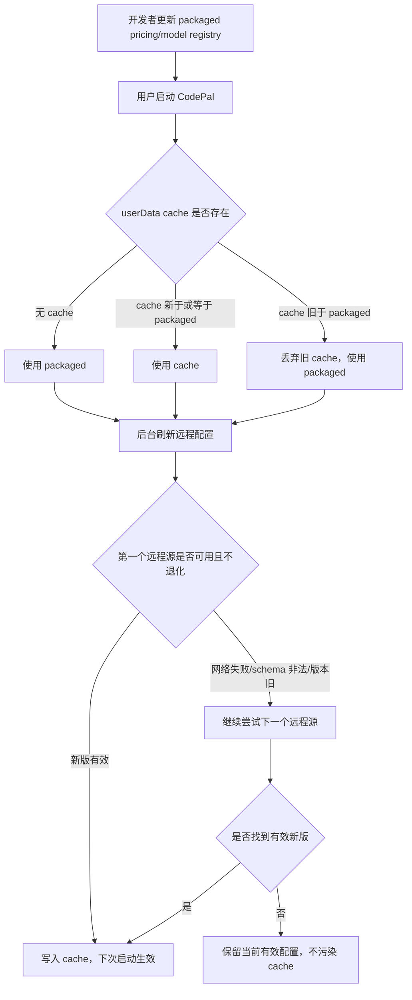

# 产品需求文档：CodePal V1.5.3（远程配置防退化闭环修复）

> 文档版本：v1.5.3-r1  
> 创建日期：2026-04-25  
> 对应版本：`v1.5.3`  
> 版本类型：`debug / 架构稳定性修复`  
> 对应模块：`electron/services/remoteConfigLoader.js`、`electron/services/registries/pricingRegistry.js`、`src/config/pricing.json`、`src/store/costCalculator.js`

---

## 1. 背景与问题定义

V1.5.2 已将 GPT-5.5 标准短上下文定价补入 `src/config/pricing.json`：

- input：`$5.00 / 1M tokens`
- cached input：`$0.50 / 1M tokens`
- output：`$30.00 / 1M tokens`

但开发环境启动后，用量明细中的 `gpt-5.5` 预估费用仍显示 `--`。启动日志如下：

```text
[pricing] loaded from cache, version=2026-04-18
[pricing] remote version stale (remote=2026-04-18, packaged=2026-04-25), cache not updated
[pricing] refresh skipped: REMOTE_VERSION_STALE
```

这说明本地打包版 pricing 已经是 `2026-04-25`，但运行时仍使用了用户目录中的旧 `pricing.cache.json`（`2026-04-18`），导致新模型价格没有生效。

本问题不是单个模型价格缺失，而是 V1.4.6 引入的 remote-config 架构存在“半套防退化”缺口。

---

## 2. 用户故事地图



---

## 3. 根因分析

### 3.1 问题一：启动加载只按层级，不按版本

V1.4.6 的 remote-config 初始化优先级是：

```text
cache > packaged > hardcoded
```

这个策略只考虑“远程 cache 可能比安装包新”，没有考虑“安装包升级后，旧 cache 可能比安装包老”。

在 GPT-5.5 场景中：

- `packaged pricing.json`：`2026-04-25`，包含 `gpt-5-5`
- `userData/pricing.cache.json`：`2026-04-18`，不包含 `gpt-5-5`
- 当前加载结果：旧 cache 胜出

渲染层启动后调用 `getPricingRegistry()`，又把旧 cache 注入 `costCalculator.setPricingOverride()`，覆盖了前端 import 到的新 packaged pricing，因此费用计算找不到 `gpt-5-5`。

### 3.2 问题二：远程多源 fallback 不处理版本退化

V1.4.6 的远程源顺序是：

```text
jsDelivr -> GitHub Raw
```

当前逻辑只在以下场景继续尝试下一个源：

- 网络失败
- HTTP 非 2xx
- JSON schema 非法

但 jsDelivr 返回旧版 `2026-04-18` 时，schema 是合法的，所以 `fetchRemote()` 会把它当作成功结果返回。后续 `refreshRemoteConfigInBackground()` 再发现它比 packaged 旧，于是拒绝写 cache 并结束流程。

这导致 GitHub Raw 虽然已经是新版 `2026-04-25`，也没有机会被尝试。

### 3.3 问题三：防退化逻辑只覆盖写入，不覆盖读取

当前已有 `isRemoteVersionStale(remote, packaged)`，可阻止旧远程数据写入 cache。但它只在后台刷新阶段执行。

缺失的覆盖面：

- 启动读取 cache 时没有版本比较
- 多远程源选择时没有版本比较
- stale cache 没有自动修复

因此系统只做到了“旧远程不继续污染 cache”，没有做到“旧 cache 不继续污染运行态”。

---

## 4. 本版目标

### 目标 1：启动时阻止旧 cache 覆盖新版 packaged

当 cache 与 packaged 都合法，且两者都有可比较版本时：

- `cache.version >= packaged.version`：使用 cache
- `cache.version < packaged.version`：使用 packaged，并修复旧 cache

### 目标 2：远程刷新遇到旧源时继续 fallback

当任一远程源返回合法 JSON，但 `remote.version < packaged.version` 时：

- 视为该源不可用
- 打日志说明版本退化
- 继续尝试下一个远程源

### 目标 3：所有可用配置中选择“不低于 packaged 的最新可用配置”

本版不追求复杂版本仲裁，只保证最关键底线：

```text
运行态配置不得低于当前 packaged version
```

如果 cache 或远程比 packaged 新，仍允许它们胜出。

### 目标 4：问题自愈

当检测到 stale cache 后，应尽可能用 packaged 覆盖 cache，避免下次启动重复踩坑。若覆盖失败，不影响本次运行态选择 packaged。

### 目标 5：补齐回归测试

至少覆盖：

- 旧 cache 被 packaged 替代
- 旧 jsDelivr 被跳过，GitHub Raw 新版被采用
- 所有远程源均旧时不写 cache
- GPT-5.5 pricing 在新版配置中可被识别

---

## 5. 非目标

以下内容不属于 V1.5.3：

- 改造 pricing schema 以支持 GPT-5.5 长上下文分档
- 修改 Usage token 聚合逻辑
- 改成实时请求 OpenAI / Anthropic 官方价格 API
- 引入 ETag、If-None-Match 或远程配置 TTL
- 给用户暴露“远程配置源选择”设置项
- 处理同版本但内容不同的远程数据冲突

同版本内容冲突仍按现有源顺序处理，后续如果需要更强一致性，可引入内容 hash 或 manifest。

---

## 6. 详细需求

### US-01：启动时使用版本安全的有效配置

作为 CodePal 用户，我希望应用启动后使用当前版本可用的最新配置，而不是被旧 cache 覆盖，这样新模型定价或模型列表能立即生效。

业务规则：

1. `loadEffective(spec, cacheFilePath)` 必须同时读取 packaged 与 cache。
2. 当 packaged 合法且 cache 合法时，必须比较版本。
3. 当 cache 版本比 packaged 老时，本次运行态必须使用 packaged。
4. 当 cache 版本等于或新于 packaged 时，本次运行态继续使用 cache。
5. 当 packaged 无合法版本时，为避免误杀历史配置，保持原兼容逻辑，不强制判定 cache stale。
6. 当 cache stale 且 packaged 可用时，应尝试用 packaged 覆盖 cache。

验收标准：

- AC-01：`cache=2026-04-18`、`packaged=2026-04-25` 时，启动 source 为 `packaged`。
- AC-02：`cache=2099-12-31`、`packaged=2026-04-25` 时，启动 source 为 `cache`。
- AC-03：stale cache 被检测到后，不应影响本次运行态。
- AC-04：stale cache 自愈失败时，不应阻断应用启动。

### US-02：远程刷新跳过版本退化源

作为 CodePal 用户，我希望 jsDelivr 某个边缘节点仍是旧版本时，应用能继续尝试 GitHub Raw，而不是直接放弃刷新。

业务规则：

1. `fetchRemote(spec)` 对每个远程源不仅做网络和 schema 校验，还必须做版本退化校验。
2. 远程版本比 packaged 老时，该源视为不可用，并继续尝试下一个源。
3. 任一后续源返回不退化版本时，应返回该源结果并允许写 cache。
4. 如果所有源都退化，应返回 `REMOTE_VERSION_STALE`。
5. 如果所有源都是网络失败或 schema 非法，应返回 `ALL_REMOTE_SOURCES_FAILED`。

验收标准：

- AC-05：jsDelivr 返回 `2026-04-18`、GitHub Raw 返回 `2026-04-25` 时，最终采用 GitHub Raw。
- AC-06：所有源都返回 `2026-04-18`，packaged 为 `2026-04-25` 时，不写 cache。
- AC-07：第一个源 schema 非法时，仍继续尝试第二个源。

### US-03：GPT-5.5 费用显示恢复

作为 Usage 用户，我希望 `gpt-5.5` 的预估费用不再显示 `--`，而是按标准短上下文价格估算。

业务规则：

1. `pricing.json` 必须包含 `gpt-5-5`。
2. `costCalculator` 将 `gpt-5.5` 归一化为 `gpt-5-5` 后应能命中定价。
3. 本版按单一价格档估算，不区分长上下文。

验收标准：

- AC-08：`gpt-5.5` 输入、输出、缓存读取均大于 0 时，费用列显示具体美元金额。
- AC-09：未知模型仍显示 `--`，不得套用 GPT-5.5 价格。

---

## 7. 技术方案

### 7.1 启动加载策略

将 `loadEffective` 从固定三层优先级：

```text
cache > packaged > hardcoded
```

调整为版本安全优先级：

```text
1. 读取 packaged
2. 读取 cache
3. 若 cache 不退化：用 cache
4. 若 cache 退化且 packaged 可用：用 packaged，并尝试覆盖旧 cache
5. 若 cache 不可用但 packaged 可用：用 packaged
6. 若两者都不可用：用 hardcoded
```

### 7.2 远程刷新策略

将 `fetchRemote` 从“第一个 schema 合法即成功”调整为：

```text
for each remote source:
  fetch
  validate schema
  compare version with packaged
  if stale:
    continue
  return source result

if any source stale:
  return REMOTE_VERSION_STALE
return ALL_REMOTE_SOURCES_FAILED
```

### 7.3 版本比较规则

继续沿用当前格式：

```text
YYYY-MM-DD
YYYY-MM-DD.N
```

比较规则不扩展，避免引入迁移风险。当前字符串比较足以支持这两类版本。

---

## 8. 测试策略

### 自动化覆盖

- Unit：remoteConfigLoader 版本比较、loadEffective、fetchRemote、refresh 写 cache。
- Integration：pricingRegistry + costCalculator 的 GPT-5.5 命中链路。
- E2E：本版不新增 Electron E2E，原因是问题核心在主进程配置加载策略，可用 Node 测试稳定覆盖；真实 UI 费用显示建议人工复核一次。

### 人工补测

1. 清理或保留旧 `pricing.cache.json` 后启动 dev。
2. 确认日志不再出现 `pricing loaded from cache, version=2026-04-18` 作为最终生效配置。
3. 进入 Usage，确认 `gpt-5.5` 费用列显示具体金额。

---

## 9. 发布与回滚

### 发布方式

- 代码随 `v1.5.3` 打包发版。
- `src/config/pricing.json` 已通过 GitHub Raw 远程链路分发。
- jsDelivr 若短期仍有旧边缘节点，新版逻辑会跳过该旧源并尝试 GitHub Raw。

### 回滚策略

如果新版加载逻辑出现异常：

- 删除或回滚 `remoteConfigLoader.js` 相关提交即可恢复旧优先级。
- 由于本版不改变 pricing schema，不涉及用户数据迁移。

### 风险

- 如果 packaged 自身版本号写错偏大，远程新版可能被误判为旧版。
- 如果同一 version 内容不同，当前逻辑无法识别内容差异。
- 如果 GitHub Raw 与 jsDelivr 均不可达，应用仍使用 packaged 或 hardcoded，数据可能滞后但不影响启动。

